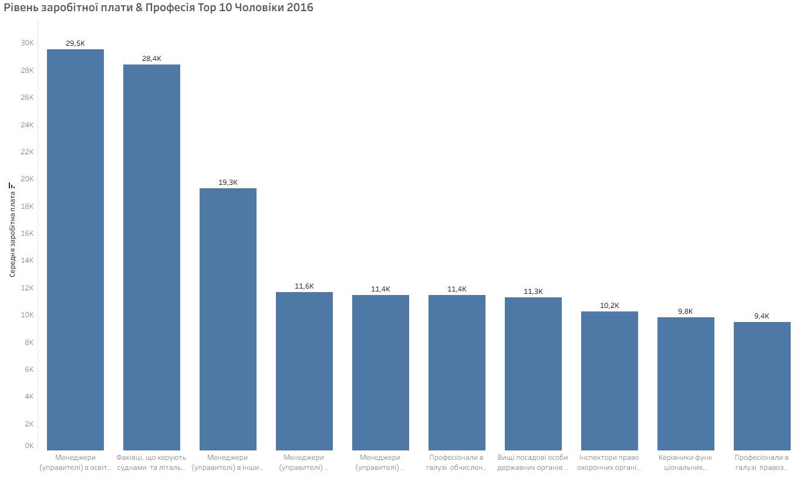
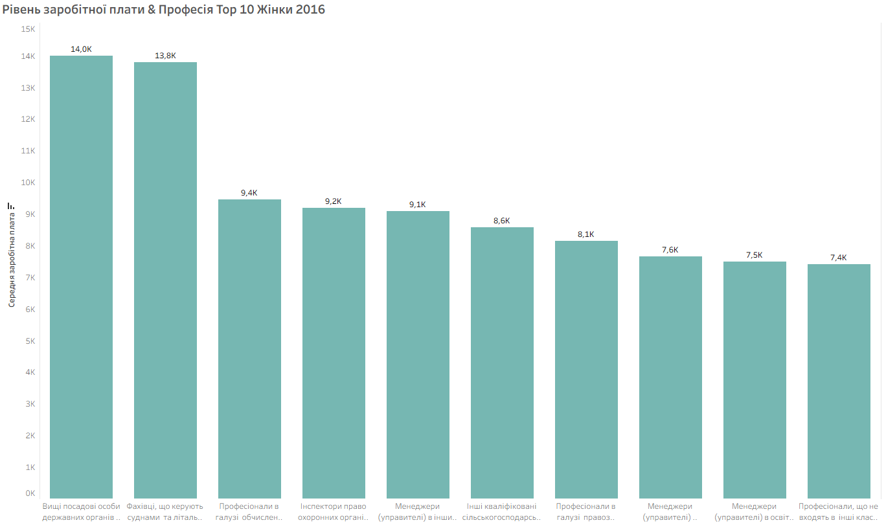
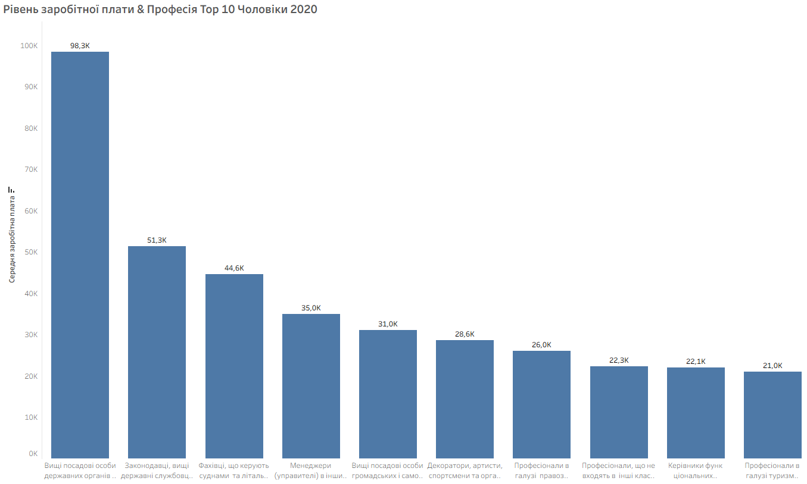
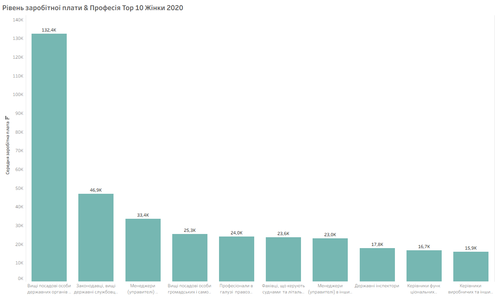
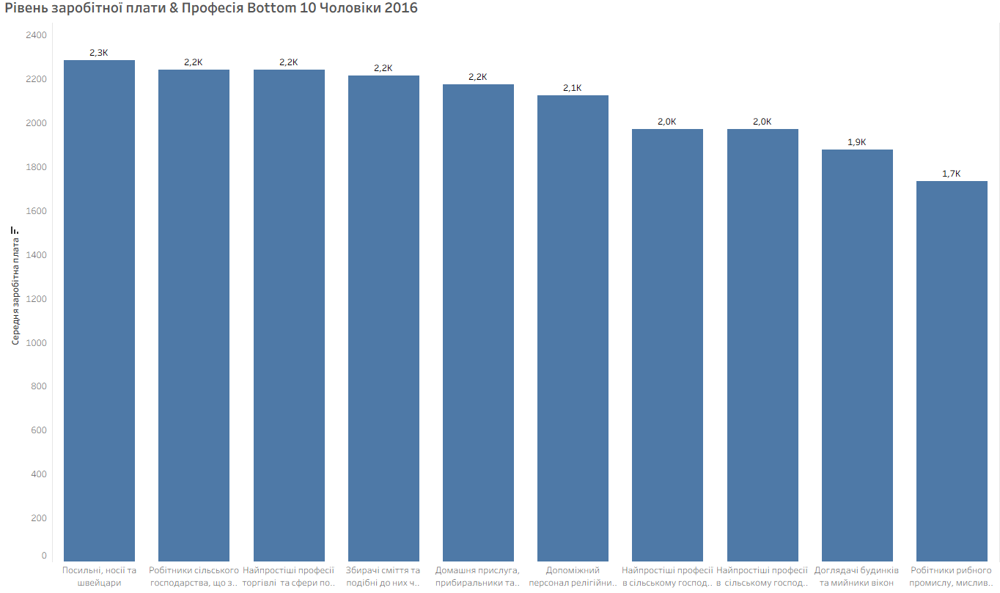
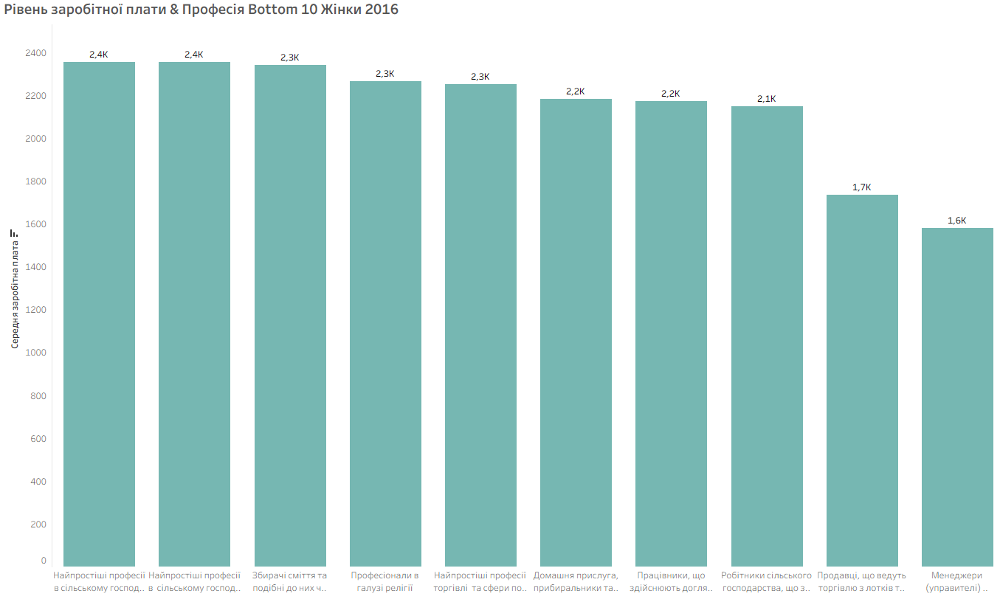
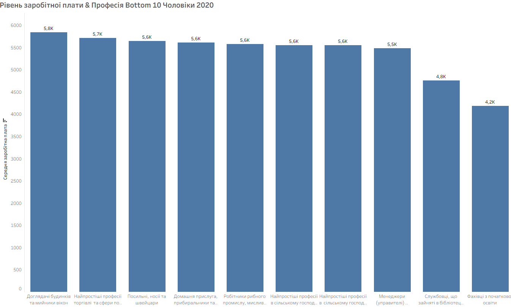
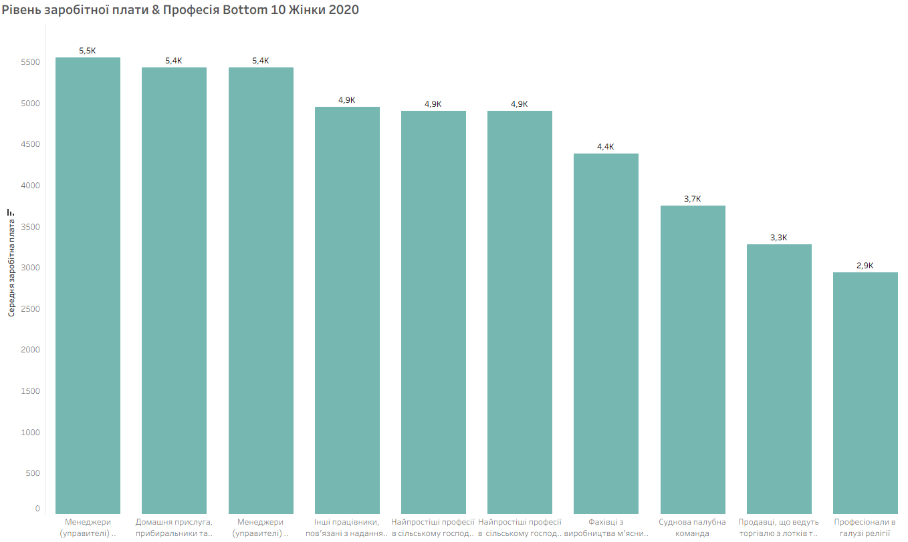
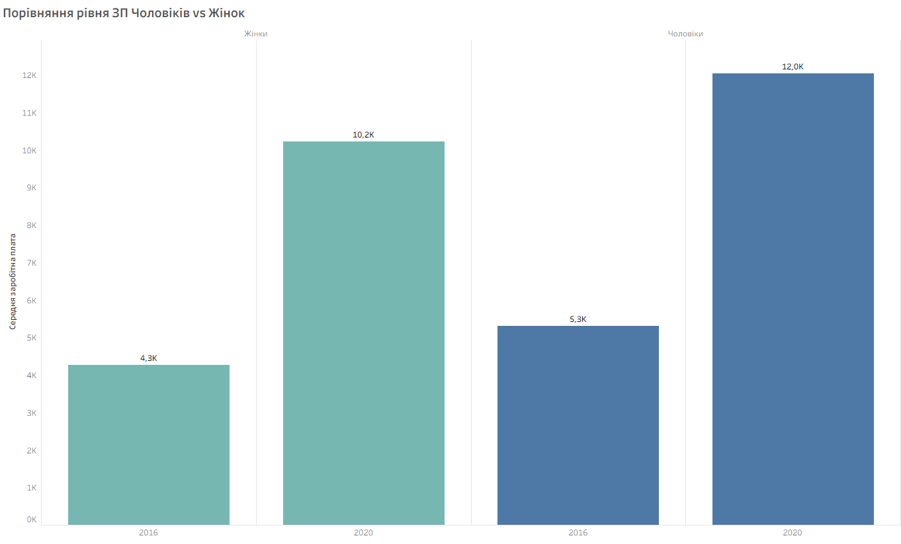

# Аналіз рівня заробітної плати працівників в Україні за 2016 та 2020 роки за даними Державної служби статистики України

##  Про проєкт

Дослідницький проєкт присвячений аналізу відмінностей у рівні заробітної плати працівників в Україні у **2016 та 2020 роках** залежно від статі, рівня освіти, вікової категорії, стажу роботи, професії та виду економічної діяльності.

Метою дослідження є виявлення закономірностей у розподілі заробітної плати між різними соціально-демографічними та професійними групами та порівняння отриманих результатів між 2016 і 2020 роками.

**Джерело даних:** Офіційні звіти [Державної служби статистики України](https://stat.gov.ua/).

---

##  Питання дослідження

> **Які відмінності в рівні заробітної плати працівників в Україні спостерігалися у 2016 та 2020 роках залежно від статі, рівня освіти, вікової категорії, стажу роботи, професії та виду економічної діяльності?**

---

##  Мета дослідження

Проаналізувати відмінності в рівні заробітної плати працівників в Україні залежно від статі, освіти, віку, стажу роботи, професії та виду економічної діяльності та порівняти отримані результати між 2016 і 2020 роками.

---

## 💡 Гіпотези

* **Освіта:** рівень заробітної плати відрізняється залежно від рівня освіти та загалом є вищим серед працівників із вищим рівнем освіти.
* **Вік:** рівень заробітної плати відрізняється між віковими групами та зростає до певної вікової категорії, після чого може стабілізуватися або знижуватися.
* **Стаж:** працівники з більшим стажем мають вищий рівень заробітної плати.
* **Професія:** рівень заробітної плати суттєво відрізняється між професійними групами.
* **Вид економічної діяльності:** рівень заробітної плати суттєво відрізняється між видами економічної діяльності.
* **Стать:** рівень заробітної плати відрізняється між чоловіками та жінками, причому середня заробітна плата чоловіків є вищою.

---

# 📊 Результати дослідження

## 1. Рівень освіти

Аналіз показав виражені відмінності в середньому рівні заробітної плати залежно від рівня освіти.

В обох досліджуваних роках спостерігається однакова послідовність рівнів заробітної плати — від найвищого до найнижчого:

1. Магістратура або її еквівалент
2. Бакалаврат або його еквівалент
3. Короткий цикл вищої освіти
4. Післясередня не вища освіта
5. Перший етап середньої освіти
6. Початкова освіта

Загалом працівники з вищим рівнем освіти мають вищу середню заробітну плату.

Також у цьому розрізі простежується стабільна гендерна відмінність: середня заробітна плата чоловіків є вищою за заробітну плату жінок.

**Висновок:** гіпотеза про зв'язок між рівнем освіти та заробітною платою підтверджується на рівні спостережуваних даних.

---

## 2. Вікова категорія

Найвищий рівень середньої заробітної плати спостерігається у працівників віком **35–44 роки**.

Розподіл за рівнем заробітної плати:

1. 35–44 роки
2. 25–34 роки
3. 45–54 роки
4. 55–59 років
5. 60–64 роки
6. 65 років і старші
7. До 25 років

Загальна структура є подібною у 2016 та 2020 роках.

Таким чином, залежність між віком та заробітною платою не є лінійною: найвищий рівень спостерігається у віковій категорії 35–44 роки, після чого середня заробітна плата знижується.

**Висновок:** гіпотеза підтверджується — рівень заробітної плати відрізняється між віковими групами та має нелінійну структуру.

---

## 3. Стаж роботи

Найвищий рівень середньої заробітної плати спостерігається серед працівників зі стажем **15–19 років**.

У 2016 році після цієї групи розташовуються:

* 20 років і більше;
* 10–14 років;
* 5–9 років;
* 2–4 роки;
* до 2 років.

У 2020 році структура була подібною: найвищий рівень спостерігався у групі 15–19 років, далі — у групах 10–14 років та 20 років і більше.

Загалом працівники з невеликим стажем мають найнижчий рівень заробітної плати, тоді як найвищі значення спостерігаються серед працівників із більшим стажем.

**Висновок:** гіпотеза загалом підтверджується, хоча залежність між стажем і зарплатою не є строго лінійною.

---

## 4. Вид економічної діяльності

Аналіз показав значні відмінності в рівні заробітної плати між видами економічної діяльності.

### 2016 рік

Серед жінок найвищий рівень заробітної плати спостерігався у:

1. Фінансовій та страховій діяльності
2. Інформації та телекомунікаціях
3. Професійній, науковій та технічній діяльності

Серед чоловіків топ-3 складали ті самі сфери.

### 2020 рік

Серед жінок:

1. Інформація та телекомунікації
2. Фінансова та страхова діяльність
3. Державне управління й оборона

Серед чоловіків:

1. Інформація та телекомунікації
2. Фінансова та страхова діяльність
3. Добувна промисловість та розроблення кар'єрів

**Висновок:** вид економічної діяльності є важливою характеристикою, за якою спостерігаються значні відмінності в рівні заробітної плати.

---

# 5. Рівень заробітної плати за професіями

Професійний розріз продемонстрував значні відмінності між окремими професійними групами.

Для детальнішого аналізу професії були розглянуті окремо за **статтю, роком та рівнем середньої заробітної плати**.

## 5.1. Найвища середня заробітна плата — 2016 рік

### Чоловіки

Топ-10 професій із найвищою середньою заробітною платою:

### Жінки

Серед найвищих значень у 2016 році спостерігалися:

* серед чоловіків — менеджери в освіті, охороні здоров'я та соціальній сфері; фахівці, що керують суднами та літальними апаратами; менеджери в інших видах економічної діяльності;
* серед жінок — вищі посадові особи державних органів влади; фахівці, що керують суднами та літальними апаратами; професіонали в галузі обчислень (комп'ютеризації).

---

## 5.2. Найвища середня заробітна плата — 2020 рік

### Чоловіки

### Жінки

У 2020 році серед професій із найвищим рівнем оплати праці спостерігалися:

* вищі посадові особи державних органів влади;
* законодавці та вищі державні службовці;
* фахівці, що керують суднами та літальними апаратами;
* менеджери в окремих видах економічної діяльності.

---

## 5.3. Найнижча середня заробітна плата — 2016 рік

### Чоловіки

### Жінки

Серед професій із найнижчим рівнем оплати праці у 2016 році спостерігалися переважно професії у сільському господарстві, торгівлі та сфері обслуговування.

---

## 5.4. Найнижча середня заробітна плата — 2020 рік

### Чоловіки

### Жінки

У 2020 році до професій із найнижчими середніми значеннями увійшли, зокрема, окремі професії у сільському господарстві, торгівлі, бібліотечній та поштовій сферах, початковій освіті та інших видах діяльності.

**Висновок:** між професійними групами спостерігаються значні відмінності у рівні середньої заробітної плати, тому професія є одним із найбільш помітних факторів диференціації оплати праці.

---

# 6. Гендерний розрив у заробітній платі

Окреме порівняння середньої заробітної плати чоловіків і жінок показало, що в обох досліджуваних роках середній рівень заробітної плати чоловіків був вищим.

Ця відмінність також простежується при аналізі заробітної плати за рівнем освіти, віковими категоріями, стажем роботи та видами економічної діяльності.

**Висновок:** гіпотеза про відмінності в рівні заробітної плати між чоловіками та жінками підтверджується на рівні спостережуваних даних.

---

## Загальні висновки

Проведений аналіз показав, що рівень заробітної плати працівників в Україні суттєво відрізняється залежно від соціально-демографічних характеристик та сфери зайнятості.

Основні результати:

* **Освіта:** вищий рівень освіти пов'язаний із вищим середнім рівнем заробітної плати.
* **Вік:** найвищий рівень заробітної плати спостерігається у групі 35–44 роки; залежність не є лінійною.
* **Стаж:** найвищі значення спостерігаються серед працівників зі стажем 15–19 років та більше.
* **Професія:** між професійними групами існують значні відмінності в рівні заробітної плати.
* **Вид економічної діяльності:** рівень оплати праці суттєво відрізняється між галузями; серед найвищих за оплатою стабільно представлені фінансова діяльність та інформація і телекомунікації.
* **Стать:** у досліджуваних даних середня заробітна плата чоловіків вища за середню заробітну плату жінок.

Загалом порівняння 2016 та 2020 років показує **подібну структуру основних відмінностей**, хоча окремі професійні та галузеві групи змінюють свої позиції.

> **Важливо:** результати дослідження описують спостережувані відмінності та зв'язки в даних і не дозволяють робити висновки про причинно-наслідковий вплив окремих факторів на рівень заробітної плати.

---

# 💡 Рекомендації

## На рівні громадян

* Інвестувати в освіту та професійний розвиток.
* Розвивати навички та спеціалізації, затребувані у сферах із вищим рівнем оплати праці.
* Під час вибору професії враховувати не лише поточну зарплату, а й перспективність професії та можливості професійного розвитку.
* Порівнювати власну заробітну плату з ринковими показниками з урахуванням професії, досвіду, освіти та галузі.

## На рівні бізнесу

* Регулярно аналізувати конкурентоспроможність системи оплати праці.
* Переглядати рівень винагороди з урахуванням професії, кваліфікації та досвіду працівників.
* Аналізувати гендерні відмінності в оплаті праці всередині компанії.
* Запроваджувати прозорі критерії формування заробітної плати та кар'єрного розвитку.
* Інвестувати у професійне навчання та розвиток працівників.

## На рівні держави

* Розвивати систему професійної та вищої освіти відповідно до потреб ринку праці.
* Підтримувати програми професійної перепідготовки та підвищення кваліфікації.
* Регулярно публікувати відкриті статистичні дані щодо оплати праці за статтю, віком, освітою, професіями та видами економічної діяльності.
* Продовжувати роботу над зменшенням необґрунтованих гендерних відмінностей в оплаті праці.
* Використовувати статистичні дані для формування політики зайнятості та розвитку людського капіталу.

---

##  Інструменти

* **Python** — очищення та первинний аналіз даних
* **Pandas** — обробка та трансформація даних
* **Tableau** — аналіз та візуалізація даних
* **Jupyter Notebook** — дослідницький аналіз даних

---

##  Основний висновок

Результати дослідження показують, що рівень заробітної плати працівників в Україні суттєво відрізняється залежно від освіти, віку, стажу, професії, виду економічної діяльності та статі.

Найбільш помітні відмінності спостерігаються між професійними групами, рівнями освіти та видами економічної діяльності.

Водночас у досліджуваних даних простежується стабільна гендерна різниця: середня заробітна плата чоловіків є вищою за середню заробітну плату жінок.

Порівняння 2016 та 2020 років показує, що основні закономірності розподілу заробітної плати зберігаються, хоча окремі професійні та галузеві групи змінюють свої позиції.