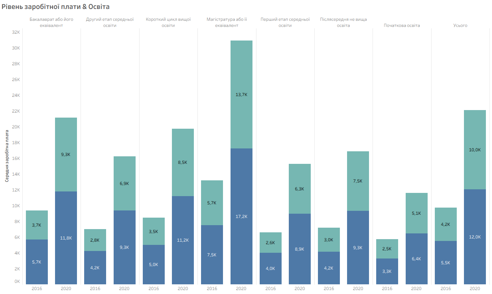
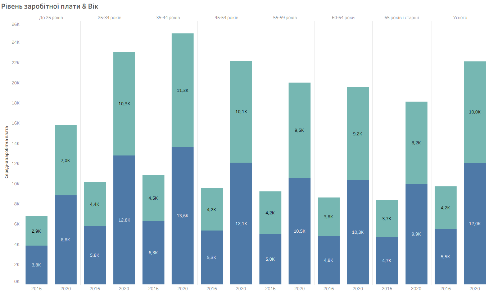
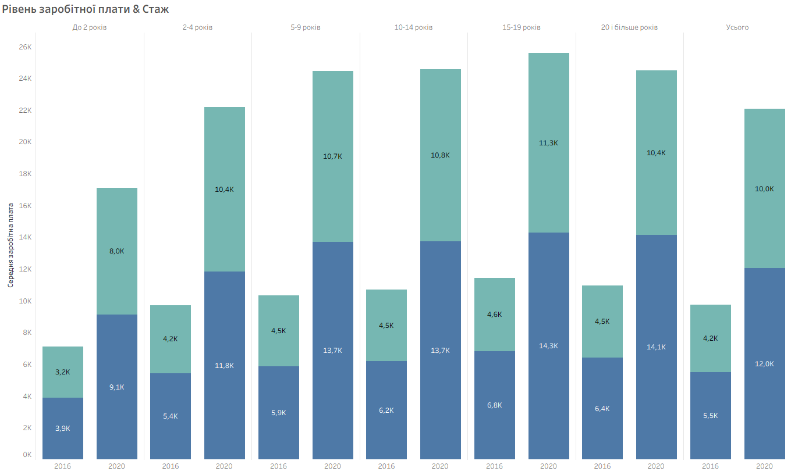
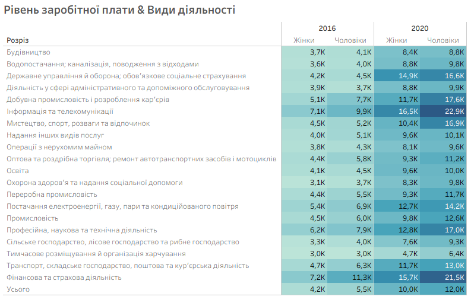
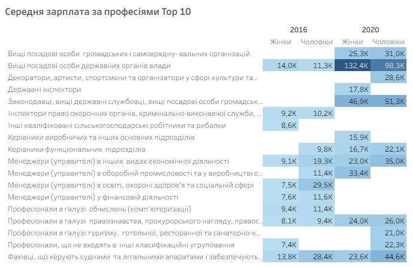
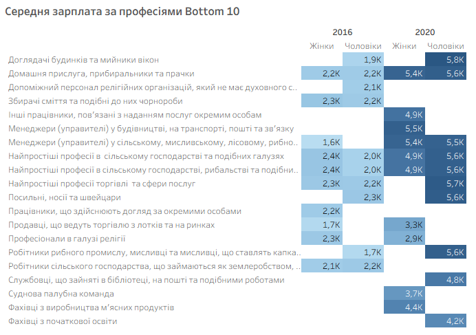

# Аналіз середньої заробітної плати працівників в Україні у 2016 та 2020 роках

## Про проєкт

Державна служба статистики України збирає дані про зарплату за допомогою державних статистичних спостережень. Відомство опитує підприємства та установи за спеціальними формами звітності з праці.

Цей дослідницький проєкт було реалізовано на основі набору даних **«Рівень заробітної плати працівників за статтю, віком, освітою та професійними групами»** з сайту Державної служби статистики України та присвячено аналізу відмінностей у рівні середньої заробітної плати працівників в Україні у **2016 та 2020 роках** залежно від статі, рівня освіти, вікової категорії, стажу роботи, професії та виду економічної діяльності.

Метою дослідження є виявлення закономірностей у розподілі заробітної плати між різними соціально-демографічними та професійними групами та порівняння отриманих результатів між 2016 і 2020 роками.

**Джерело даних:** офіційні звіти [Державної служби статистики України](https://stat.gov.ua/).

---

## Питання дослідження

> **Які відмінності в рівні заробітної плати працівників в Україні спостерігалися у 2016 та 2020 роках залежно від статі, рівня освіти, вікової категорії, стажу роботи, професії та виду економічної діяльності?**

---

## Мета дослідження

Проаналізувати відмінності в рівні заробітної плати працівників в Україні залежно від статі, освіти, віку, стажу роботи, професії та виду економічної діяльності та порівняти отримані результати між 2016 і 2020 роками, щоб:

- виявити основні фактори, пов'язані з рівнем заробітної плати;
- визначити найбільш і найменш оплачувані категорії працівників;
- оцінити зміни у структурі оплати праці за цей період.

---

## 💡 Гіпотези

- **Освіта:** рівень заробітної плати відрізняється залежно від рівня освіти та загалом є вищим серед працівників із вищим рівнем освіти.
- **Вік:** рівень заробітної плати відрізняється між віковими групами та зростає до певної вікової категорії, після чого може стабілізуватися або знижуватися.
- **Стаж:** працівники з більшим стажем мають вищий рівень заробітної плати.
- **Професія:** рівень заробітної плати суттєво відрізняється між професійними групами.
- **Вид економічної діяльності:** рівень заробітної плати суттєво відрізняється між видами економічної діяльності.
- **Стать:** рівень заробітної плати відрізняється між чоловіками та жінками, причому середня заробітна плата чоловіків є вищою.

---

## 📊 Live Dashboard

🔗 **Tableau Public:**  
[Переглянути інтерактивний дашборд](https://public.tableau.com/views/project-salary/Dashboard12?:language=en-US&publish=yes&:sid=&:redirect=auth&:display_count=n&:origin=viz_share_link)

---

# 📊 Результати дослідження

## 1. Рівень освіти

Аналіз показав виражені відмінності в середньому рівні заробітної плати залежно від рівня освіти.

В обох досліджуваних роках спостерігається однакова послідовність рівнів заробітної плати — від найвищого до найнижчого:

1. Магістратура або її еквівалент
2. Бакалаврат або його еквівалент
3. Короткий цикл вищої освіти
4. Післясередня не вища освіта
5. Другий етап середньої освіти
6. Перший етап середньої освіти
7. Початкова освіта

Загалом працівники з вищим рівнем освіти мають вищу середню заробітну плату. При цьому така закономірність зберігається і в 2016, і в 2020 році, що свідчить про стійкий зв'язок між рівнем освіти та рівнем оплати праці в досліджуваних даних.

У 2020 році середня заробітна плата зросла порівняно з 2016 роком у всіх основних освітніх категоріях. Водночас ієрархія освітніх груп за рівнем заробітної плати практично не змінилася. Це означає, що загальне підвищення заробітної плати не призвело до суттєвої зміни позицій освітніх груп одна відносно одної.

Також у цьому розрізі простежується гендерний розрив: середня заробітна плата чоловіків є вищою за середню заробітну плату жінок у відповідних освітніх категоріях.

**Висновок:** гіпотеза про зв'язок між рівнем освіти та заробітною платою підтверджується на рівні спостережуваних даних. Вища освіта асоціюється з вищим рівнем середньої заробітної плати, а ця закономірність зберігається протягом досліджуваного періоду.

Водночас на рівень заробітної плати можуть впливати й інші характеристики працівників та умови праці, тому за цими даними не можна стверджувати, що саме освіта є причиною вищої заробітної плати.

---

## 2. Вікова категорія

Аналіз показав, що середня заробітна плата суттєво відрізняється залежно від віку працівників. При цьому залежність між віком та рівнем заробітної плати не є лінійною.

Найвищий рівень середньої заробітної плати в обох досліджуваних роках спостерігається у працівників віком **35–44 роки**. Найнижчий рівень характерний для працівників віком **до 25 років**.

В обох досліджуваних роках спостерігається однакова послідовність розподілу рівнів заробітної плати — від найвищого до найнижчого:

1. 35–44 роки
2. 25–34 роки
3. 45–54 роки
4. 55–59 років
5. 60–64 роки
6. 65 років і старші
7. До 25 років

Така структура свідчить про те, що середня заробітна плата зростає на початку професійної кар'єри та досягає максимального рівня у віковій групі 35–44 роки. Після цього спостерігається поступове зниження середньої заробітної плати у старших вікових категоріях. Таким чином, збільшення віку після 35–44 років не супроводжується подальшим зростанням середньої заробітної плати.

Найнижчий рівень оплати праці у групі до 25 років може бути пов'язаний із початком професійної кар'єри, меншим досвідом роботи та, відповідно, меншою тривалістю трудового стажу.

Зниження середньої заробітної плати у старших вікових групах може бути пов'язане з відмінностями у характері та інтенсивності зайнятості, професійній структурі та інших характеристиках працівників. Зокрема, потенційними чинниками можуть бути перехід на менш навантажені посади, скорочення робочого часу або менша кількість понаднормової роботи.

Проте ці припущення потребують додаткової перевірки, оскільки відповідні показники відсутні в досліджуваному наборі даних. На основі цього аналізу не можна визначити причинно-наслідковий зв'язок між віком і заробітною платою.

Важливо, що така сама послідовність вікових груп зберігається і в 2016, і в 2020 році. Отже, хоча загальний рівень середньої заробітної плати у 2020 році зріс порівняно з 2016 роком, структура її розподілу за віком суттєво не змінилася.

Окремо простежується стійка гендерна різниця в оплаті праці. У кожній віковій категорії середня заробітна плата чоловіків є вищою за середню заробітну плату жінок. Ця закономірність спостерігається як у 2016, так і в 2020 році, тобто гендерний розрив зберігається незалежно від вікової категорії.

Таким чином, вік і стать одночасно пов'язані з відмінностями у середньому рівні заробітної плати: найвищі значення спостерігаються у віковій групі 35–44 роки, тоді як у межах кожної вікової категорії середня заробітна плата чоловіків перевищує відповідний показник для жінок.

**Висновок:** гіпотеза підтверджується на рівні спостережуваних даних — середня заробітна плата відрізняється між віковими групами та має нелінійну структуру. Найвищий рівень оплати праці спостерігається у віці 35–44 роки, після чого середня заробітна плата поступово знижується. Водночас у всіх вікових групах зберігається гендерна різниця на користь чоловіків.

---

## 3. Стаж роботи

Аналіз показав, що середня заробітна плата відрізняється залежно від тривалості стажу роботи, однак ця залежність не є строго лінійною.

Найвищий рівень середньої заробітної плати в обох досліджуваних роках спостерігається серед працівників зі стажем **15–19 років**. Водночас працівники зі стажем **до 2 років** мають найнижчий рівень середньої заробітної плати, що узгоджується з очікуванням про нижчу оплату праці на початкових етапах професійної кар'єри.

### 2016 рік

1. 15–19 років
2. 20 років і більше
3. 10–14 років
4. 5–9 років
5. 2–4 роки
6. До 2 років

### 2020 рік

1. 15–19 років
2. 10–14 років
3. 20 років і більше
4. 5–9 років
5. 2–4 роки
6. До 2 років

Таким чином, у 2016 та 2020 роках зберігається загальна закономірність: працівники з найменшим стажем мають найнижчу середню заробітну плату, а зі збільшенням стажу рівень оплати праці зростає до певного моменту. Максимальне значення припадає на групу зі стажем 15–19 років.

Водночас після досягнення стажу 20 років і більше середня заробітна плата не продовжує зростати, а виявляється нижчою, ніж у групі 15–19 років.

Це особливо важливий результат, оскільки він показує, що накопичення стажу саме по собі не гарантує подальшого зростання заробітної плати.

Одним із можливих пояснень може бути взаємозв'язок між стажем і віком працівників. Значний стаж роботи часто відповідає старшому віку, а в попередньому аналізі ми вже побачили, що після вікової групи 35–44 роки середня заробітна плата поступово знижується.

Тому нижчий рівень оплати праці у групі 20+ років стажу порівняно з групою 15–19 років може частково пояснюватися тим, що до неї входить більша частка працівників старших вікових категорій.

При цьому не можна стверджувати, що саме вік є причиною нижчої зарплати працівників із великим стажем. На цей показник можуть одночасно впливати вік, професія, стать, рівень освіти, вид економічної діяльності та характер зайнятості.

Для підтвердження такого взаємозв'язку потрібен додатковий перехресний аналіз, наприклад порівняння заробітної плати працівників із різним стажем у межах однакових вікових груп.

Також у цьому розрізі варто зазначити гендерну різницю: середня заробітна плата чоловіків перевищує середню заробітну плату жінок у відповідних категоріях стажу. Це означає, що гендерний розрив простежується не лише в загальному показнику, а й серед працівників із різною тривалістю трудового стажу.

**Висновок:** гіпотеза про зв'язок між стажем роботи та рівнем заробітної плати підтверджується на рівні спостережуваних даних, але залежність не є лінійною.

Середня заробітна плата зростає разом зі стажем до групи 15–19 років, де досягає максимального значення, після чого для працівників зі стажем 20 років і більше спостерігається зниження.

Це може свідчити про взаємодію стажу з іншими характеристиками працівників, зокрема з віком. Таким чином, більший стаж не завжди означає вищу середню заробітну плату.

---

## 4. Вид економічної діяльності

Аналіз показав, що вид економічної діяльності є одним із найбільш помітних факторів, пов'язаних із відмінностями в рівні середньої заробітної плати.

Рівень оплати праці суттєво відрізняється залежно від сфери діяльності, причому структура найбільш оплачуваних галузей частково змінилася між 2016 і 2020 роками.

### 2016 рік

Серед жінок найвищий рівень середньої заробітної плати спостерігався у таких сферах:

- Фінансова та страхова діяльність
- Інформація та телекомунікації
- Професійна, наукова та технічна діяльність

Серед чоловіків до трійки найбільш оплачуваних сфер увійшли ті самі види економічної діяльності:

- Фінансова та страхова діяльність
- Інформація та телекомунікації
- Професійна, наукова та технічна діяльність

Це свідчить про те, що у 2016 році високий рівень оплати праці був характерний для одних і тих самих економічних сфер незалежно від статі працівника.

### 2020 рік

У 2020 році структура найбільш оплачуваних сфер дещо змінилася.

**Серед жінок:**

1. Інформація та телекомунікації
2. Фінансова та страхова діяльність
3. Державне управління й оборона

**Серед чоловіків:**

1. Інформація та телекомунікації
2. Фінансова та страхова діяльність
3. Добувна промисловість та розроблення кар'єрів

Таким чином, інформація та телекомунікації у 2020 році посіли перше місце за рівнем середньої заробітної плати як серед жінок, так і серед чоловіків, тоді як фінансова та страхова діяльність залишилася однією з найбільш оплачуваних сфер.

Водночас третя позиція у чоловіків і жінок уже відрізняється: серед жінок її займає державне управління й оборона, а серед чоловіків — добувна промисловість та розроблення кар'єрів.

Це свідчить про те, що гендерні відмінності проявляються не лише в абсолютному рівні заробітної плати, а й у структурі найбільш оплачуваних сфер діяльності.

Окремо простежується стійка гендерна різниця в оплаті праці. Середня заробітна плата чоловіків є вищою за середню заробітну плату жінок, у тому числі в межах окремих видів економічної діяльності.

Тобто навіть приналежність до однієї й тієї самої високоооплачуваної сфери не усуває гендерної різниці в середньому рівні заробітної плати.

Водночас результати показують, що галузь діяльності може бути важливішою характеристикою для рівня оплати праці, ніж просте порівняння середньої зарплати по країні.

Працівники, зайняті у фінансовій сфері, ІТ та телекомунікаціях, професійній, науковій і технічній діяльності або добувній промисловості, мають суттєво інші рівні середньої заробітної плати порівняно з працівниками інших сфер.

Це може бути пов'язано з відмінностями у вимогах до кваліфікації, характері роботи, продуктивності праці та рівні оплати в конкретних галузях, однак ці причини не можуть бути безпосередньо встановлені на основі наявного набору даних.

**Висновок:** гіпотеза про зв'язок між видом економічної діяльності та рівнем заробітної плати підтверджується на рівні спостережуваних даних.

Середня заробітна плата суттєво відрізняється між сферами діяльності, а до найбільш оплачуваних у 2016 та 2020 роках стабільно належать інформація та телекомунікації та фінансова і страхова діяльність.

При цьому між 2016 і 2020 роками відбулася часткова зміна структури найбільш оплачуваних сфер: у 2020 році інформація та телекомунікації вийшли на перше місце, а третя позиція вже відрізнялася залежно від статі.

Гендерний розрив у заробітній платі зберігається і в галузевому розрізі: чоловіки мають вищу середню заробітну плату, ніж жінки.

Отже, рівень оплати праці формується не під впливом одного фактора, а є результатом поєднання характеристик працівника та сфери його зайнятості.

---

# 5. Рівень заробітної плати за професіями

Професійний розріз продемонстрував найбільш виражену диференціацію середньої заробітної плати серед досліджуваних характеристик.

Рівень оплати праці суттєво відрізняється не лише між професійними групами, а й залежно від статі та року спостереження.

Для детальнішого аналізу професії було розглянуто окремо за статтю, роком та рівнем середньої заробітної плати.

Для цього використано теплову карту, яка дозволяє одночасно порівняти велику кількість професійних груп та виявити найбільш і найменш оплачувані категорії.

## 5.1. Найвища середня заробітна плата

У 2016 році серед найбільш оплачуваних професій спостерігалися суттєві відмінності залежно від статі.

**Серед чоловіків** найвищі показники середньої заробітної плати спостерігалися у:

- менеджерів в освіті, охороні здоров'я та соціальній сфері;
- фахівців, що керують суднами та літальними апаратами;
- менеджерів в інших видах економічної діяльності.

**Серед жінок** до найбільш оплачуваних професій належали:

- вищі посадові особи державних органів влади;
- фахівці, що керують суднами та літальними апаратами;
- професіонали в галузі обчислень (комп'ютеризації).

Вже у 2016 році можна побачити, що високий рівень заробітної плати концентрується переважно у професіях із високим рівнем відповідальності, управлінськими функціями або спеціалізованими професійними навичками.

У 2020 році склад найбільш оплачуваних професій дещо змінився.

Серед найвищих значень спостерігалися:

- вищі посадові особи державних органів влади;
- законодавці та вищі державні службовці;
- фахівці, що керують суднами та літальними апаратами;
- менеджери в окремих видах економічної діяльності — серед чоловіків;
- менеджери (управителі) в оборонній промисловості та у виробництві електроенергії, газу та води — серед жінок.

Особливо цікавим є нетиповий гендерний результат: у професії **«вищі посадові особи державних органів влади»** середня заробітна плата жінок у 2020 році перевищує відповідний показник чоловіків.

Цей результат важливий, оскільки показує, що хоча загальна тенденція до вищої середньої заробітної плати чоловіків зберігається, гендерний розрив не є однаковим для всіх професій.

В окремих професійних групах жінки можуть мати вищу середню заробітну плату, ніж чоловіки.

**Таким чином, професія суттєво змінює картину гендерної нерівності в оплаті праці: загальний розрив між чоловіками та жінками не можна однаково переносити на кожну професійну категорію.**

---

## 5.2. Найнижча середня заробітна плата

На протилежному боці розподілу переважно знаходяться професії, пов'язані з сільським господарством, торгівлею, обслуговуванням та іншими видами роботи з нижчим рівнем оплати праці.

У 2016 році **серед жінок** найнижчі показники спостерігалися, зокрема, серед:

- робітників сільського господарства, що займаються землеробством і тваринництвом;
- продавців, які здійснюють торгівлю з лотків та на ринках;
- менеджерів (управителів) у сільському, мисливському, лісовому, рибному та водному господарствах.

**Серед чоловіків** найнижчі значення спостерігалися серед:

- працівників найпростіших професій у сільському господарстві та подібних галузях;
- працівників найпростіших професій у сільському господарстві, рибальстві та подібних галузях;
- доглядачів будинків та мийників вікон;
- робітників рибного промислу, мисливців та мисливців, що ставлять капкани.

У 2020 році серед найменш оплачуваних професій також переважали окремі професії у сільському господарстві, торгівлі, бібліотечній та поштовій сферах, початковій освіті та інших видах діяльності.

Таким чином, професійна структура найменш оплачуваних груп також демонструє певну стабільність: до категорій із найнижчою середньою заробітною платою в обох роках переважно належать професії, пов'язані з простішими видами робіт, сільським господарством, торгівлею та сферою обслуговування.

**Висновок:** гіпотеза про зв'язок між професією та рівнем заробітної плати підтверджується на рівні спостережуваних даних.

Професійна група є одним із найбільш помітних чинників диференціації середньої заробітної плати: між найбільш і найменш оплачуваними професіями спостерігаються значні відмінності.

Найвищі рівні оплати праці переважно характерні для керівних, висококваліфікованих та спеціалізованих професій, тоді як найнижчі — для професій у сільському господарстві, торгівлі, обслуговуванні та інших видах діяльності з нижчим рівнем оплати.

Водночас результати 2016 і 2020 років свідчать про зміну структури найбільш оплачуваних професій, а гендерний аналіз показує, що різниця в оплаті праці чоловіків і жінок залежить від конкретної професії та не є однаковою для всіх професійних груп.

---

# 6. Гендерний розрив у заробітній платі

Порівняння середньої заробітної плати за статтю показало, що в обох досліджуваних роках чоловіки мали вищий середній рівень заробітної плати, ніж жінки.

### 2016 рік

- **Жінки** — 4,3 тис. грн
- **Чоловіки** — 5,3 тис. грн

Таким чином, середня заробітна плата чоловіків була вищою на **1,0 тис. грн**, або приблизно **23%** порівняно із заробітною платою жінок.

### 2020 рік

- **Жінки** — 10,2 тис. грн
- **Чоловіки** — 12,0 тис. грн

Абсолютна різниця становила вже **1,8 тис. грн**, що відповідає приблизно **18%**.

Отже, у період з 2016 до 2020 року середня заробітна плата суттєво зросла для обох статей, однак абсолютна різниця між чоловіками та жінками збільшилася з 1,0 до 1,8 тис. грн.

Водночас у відносному вираженні розрив дещо скоротився — приблизно з **23% до 18%**.

Якщо розглядати обидва досліджувані періоди разом, середня заробітна плата становить:

- **Жінки** — 7,2 тис. грн
- **Чоловіки** — 8,7 тис. грн

Тобто загальна різниця становить **1,5 тис. грн**, або приблизно **21% на користь чоловіків**.

Важливо, що гендерна різниця простежується не лише в загальних показниках. У попередніх розділах дослідження вона також спостерігалася за рівнем освіти, віковими категоріями, стажем роботи та видами економічної діяльності.

Це свідчить про стійкість гендерної диференціації оплати праці в досліджуваних даних.

Водночас професійний аналіз показав, що гендерний розрив не є однаковим для всіх професійних груп. У більшості професій середня заробітна плата чоловіків є вищою, проте існують окремі професії, де різниця є меншою або, навпаки, середня заробітна плата жінок перевищує показник чоловіків.

Отже, професійна структура є одним із факторів, що впливає на величину гендерного розриву.

**Висновок:**

Гіпотеза про відмінності в рівні середньої заробітної плати між чоловіками та жінками підтверджується на рівні спостережуваних даних.

У 2016 та 2020 роках чоловіки мали вищу середню заробітну плату, причому ця закономірність переважно зберігалася в різних освітніх, вікових, стажових та галузевих категоріях.

При цьому результати демонструють цікаву динаміку гендерного розриву: у абсолютному вимірі різниця зросла з 1,0 до 1,8 тис. грн, однак у відносному вимірі скоротилася приблизно з 23% до 18%.

Це означає, що заробітні плати обох статей зростали, причому середня зарплата жінок зростала дещо швидше у відносному вираженні, хоча повністю розрив між чоловіками та жінками до 2020 року не зник.

---

# 📌 Загальні висновки

Проведений аналіз показав, що середній рівень заробітної плати в Україні суттєво диференціюється залежно від соціально-демографічних характеристик працівників та особливостей їхньої зайнятості.

Аналіз 2016 та 2020 років дозволив виявити як стабільні закономірності, що зберігаються протягом досліджуваного періоду, так і окремі зміни у структурі найбільш та найменш оплачуваних професій і видів економічної діяльності.

## Основні результати дослідження

- **Освіта.** Простежується чіткий зв'язок між рівнем освіти та середньою заробітною платою: працівники з вищим рівнем освіти мають вищу середню заробітну плату. Ця закономірність зберігається і в 2016, і в 2020 році.

- **Вік.** Залежність між віком та заробітною платою має нелінійний характер. Середня заробітна плата зростає до вікової групи 35–44 роки, де досягає максимального рівня, після чого поступово знижується. Найнижчий рівень спостерігається серед працівників до 25 років.

- **Стаж роботи.** Заробітна плата зростає разом зі стажем до групи 15–19 років, яка має найвищий середній рівень оплати праці. Для працівників зі стажем 20 років і більше середня зарплата вже нижча, що підтверджує нелінійний характер залежності. Це також може бути пов'язано із взаємодією стажу та віку працівників.

- **Професія.** Саме професійний розріз продемонстрував одні з найбільш суттєвих відмінностей у рівні середньої заробітної плати. Найвищі значення переважно характерні для керівних, висококваліфікованих та спеціалізованих професій, тоді як серед найнижче оплачуваних переважають професії у сільському господарстві, торгівлі та сфері обслуговування.

- **Вид економічної діяльності.** Середня заробітна плата суттєво відрізняється між галузями. До найбільш оплачуваних у досліджуваний період стабільно належать інформація та телекомунікації, фінансова та страхова діяльність, хоча їхні позиції між 2016 і 2020 роками змінювалися.

- **Стать.** Гендерний розрив є стійкою закономірністю досліджуваних даних. У 2016 році середня заробітна плата чоловіків становила 5,3 тис. грн проти 4,3 тис. грн у жінок, а у 2020 році — 12,0 тис. грн проти 10,2 тис. грн відповідно. Отже, абсолютна різниця зросла з 1,0 до 1,8 тис. грн, хоча у відносному вираженні скоротилася приблизно з 23% до 18%.

## Що показало порівняння 2016 та 2020 років

Загалом у 2020 році середня заробітна плата була суттєво вищою, ніж у 2016 році, при цьому основні закономірності її диференціації збереглися.

Зокрема, в обох роках:

- найвищий рівень оплати праці за віком припадає на групу **35–44 роки**;
- найвищий рівень за стажем — на групу **15–19 років**;
- вища освіта пов'язана з вищим рівнем середньої заробітної плати;
- чоловіки в середньому отримують більше за жінок;
- між професіями та видами економічної діяльності спостерігаються значні відмінності в оплаті праці.

Водночас структура найбільш оплачуваних професій та галузей частково змінилася.

Зокрема, у 2020 році **інформація та телекомунікації** стали найбільш оплачуваною сферою як серед чоловіків, так і серед жінок.

Це свідчить про те, що поряд зі стабільними закономірностями відбувалися зміни у структурі оплати праці між окремими видами діяльності та професіями.

Таким чином, рівень заробітної плати не визначається одним окремим фактором. Найбільш помітні відмінності формуються на перетині професії, виду економічної діяльності, освіти, віку, стажу та статі.

> **Важливо:** результати дослідження описують спостережувані відмінності та взаємозв'язки в даних. Вони не дозволяють встановити причинно-наслідковий вплив окремого фактора на рівень заробітної плати.

---

# 💡 Рекомендації

Виявлені закономірності можуть бути використані для прийняття рішень на різних рівнях — від індивідуального професійного розвитку до формування політики зайнятості.

## Для працівників та тих, хто планує професійний розвиток

- Інвестувати в освіту та професійні компетенції, оскільки вищий рівень освіти в досліджуваних даних пов'язаний із вищою середньою заробітною платою.
- При виборі професії враховувати не лише поточний рівень оплати, а й довгострокові перспективи професії, попит на неї та можливості професійного розвитку.
- Розвивати спеціалізовані навички, які затребувані у сферах із вищим рівнем оплати праці, зокрема в інформації та телекомунікаціях, фінансовій та інших висококваліфікованих сферах.
- Під час оцінки власної заробітної плати порівнювати її не лише із середнім показником по країні, а з урахуванням професії, досвіду, освіти, віку та галузі.

## Для бізнесу

- Регулярно аналізувати конкурентоспроможність системи оплати праці за професіями та рівнями кваліфікації.
- Використовувати прозорі критерії формування заробітної плати та кар'єрного розвитку.
- Проводити внутрішній аналіз гендерного розриву та перевіряти, чи однакові вимоги та критерії винагороди застосовуються до працівників незалежно від статі.
- Інвестувати у професійне навчання та розвиток працівників.
- Враховувати досвід і кваліфікацію працівників при формуванні системи винагороди, водночас не розглядаючи збільшення стажу як автоматичну підставу для зростання зарплати.

## Для держави

- Розвивати систему професійної та вищої освіти відповідно до потреб ринку праці.
- Підтримувати програми професійної перепідготовки та підвищення кваліфікації.
- Створювати умови для розвитку секторів економіки з високою доданою вартістю та високим потенціалом оплати праці.
- Продовжувати моніторинг гендерних відмінностей в оплаті праці.
- Забезпечувати доступність актуальних відкритих даних щодо заробітної плати за статтю, віком, освітою, стажем, професією та видом економічної діяльності.
- Використовувати статистичні дані для формування обґрунтованої політики зайнятості, освіти та розвитку людського капіталу.

---

# 🛠 Інструменти

- **Python** — очищення, підготовка та первинний аналіз даних
- **Pandas** — обробка та трансформація даних
- **Jupyter Notebook** — дослідницький аналіз та перевірка даних
- **Tableau** — візуальний аналіз, побудова KPI, графіків та інтерактивного дашборду

---

# 🎯 Основний висновок

Проведене дослідження показало, що середній рівень заробітної плати працівників в Україні суттєво диференціюється залежно від освіти, віку, стажу, професії, виду економічної діяльності та статі.

При цьому різні фактори мають різний характер взаємозв'язку із заробітною платою.

Для **освіти** спостерігається чітка позитивна закономірність: вищий рівень освіти відповідає вищій середній заробітній платі.

Водночас залежність від **віку та стажу** має нелінійний характер: максимальний рівень оплати спостерігається у віці **35–44 роки** та при стажі **15–19 років**, після чого середня зарплата знижується.

**Професія та вид економічної діяльності** є одними з найбільш помітних характеристик диференціації оплати праці. Найбільш оплачувані професійні групи суттєво відрізняються від найменш оплачуваних, а до високоооплачуваних сфер стабільно належать **інформація та телекомунікації** та **фінансова і страхова діяльність**.

Окремо підтверджується стійка **гендерна різниця**: у середньому чоловіки мають вищу заробітну плату, ніж жінки.

При цьому у 2016–2020 роках відносний гендерний розрив скоротився приблизно з **23% до 18%**, хоча повністю не зник.

Порівняння 2016 та 2020 років показало, що загальний рівень заробітної плати зріс, але основні закономірності її диференціації залишилися відносно стабільними. Водночас змінилася позиція окремих професій та галузей, що свідчить про динаміку структури ринку праці.

**Головний результат дослідження:** рівень заробітної плати формується під впливом сукупності характеристик працівника та його професійного середовища.

Тому для коректного аналізу оплати праці недостатньо розглядати лише один фактор — найбільш повну картину дає комплексний аналіз **освіти, віку, стажу, професії, галузі та статі**.